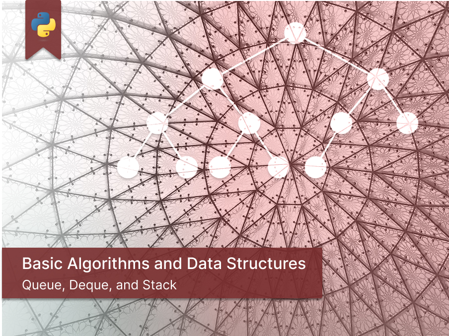
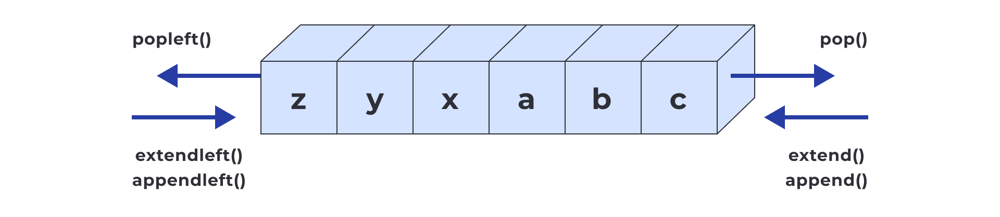
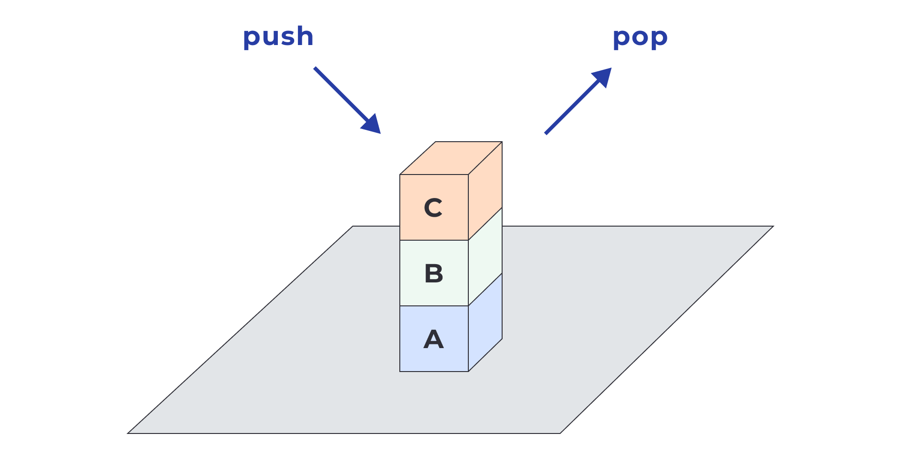

<!-- # Basic Algorithms and Data Structures <!-- omit in toc -->

<p align="center">
  
</p>

#### [# goit-algo-hw-02](https://github.com/topics/goit-algo-hw-02) <!-- omit in toc -->

## Custom implementations of basic data structures: Queue, Deque, and Stack. <!-- omit in toc -->

This project explores the fundamental concepts of **queues**, **double-ended queues (deque)**, and **stacks** through hands-on problem-solving in Python. It includes implementations that simulate real-world scenarios such as:
* Request processing in a service center using `queue.Queue`
* Palindrome checking using `collections.deque`
* Bracket matching using a `stack` to validate delimiter symmetry

## Table of Contents <!-- omit in toc -->
- [Requirements](#requirements)
  - [Task 1: Request Queue Simulation](#task-1-request-queue-simulation)
    - [Description](#description)
    - [Acceptance Criteria](#acceptance-criteria)
  - [Task 2: Palindrome Checker with Deque](#task-2-palindrome-checker-with-deque)
    - [Description](#description-1)
    - [Acceptance Criteria](#acceptance-criteria-1)
  - [Task 3: Bracket Symmetry Checker Using Stack](#task-3-bracket-symmetry-checker-using-stack)
    - [Description](#description-2)
    - [Acceptance Criteria](#acceptance-criteria-2)
- [Tasks Solution](#tasks-solution)
- [Project Setup \& Run Instructions](#project-setup--run-instructions)
  - [Prerequisites](#prerequisites)
  - [Setting Up the Development Environment](#setting-up-the-development-environment)
    - [Clone the Repository](#clone-the-repository)
  - [Run the code](#run-the-code)
    - [Run code locally](#run-code-locally)
      - [For Linux and macOS:](#for-linux-and-macos)
      - [For Windows:](#for-windows)
- [License](#license)

## Requirements

### Task 1: Request Queue Simulation

<p align="center">
  
</p>

#### Description

Develop a program that simulates the intake and processing of service requests.
The program should **automatically generate new requests** (identified by a unique number or other data), **add them to a queue**, and then **sequentially remove them from the queue for "processing"**, simulating the operation of a service center.

Here is pseudocode for the task using a **queue** (`Queue` from the `queue` module in Python) to implement the request handling system:

```python
import Queue

# Create a request queue
queue = Queue()

def generate_request():
    # Create a new request
    # Add the request to the queue

def process_request():
    if the queue is not empty:
        # Remove a request from the queue
        # Process the request
    else:
        # Output a message that the queue is empty

# Main program loop:
while user has not exited the program:
    generate_request()
    process_request()
```

In this pseudocode, two main functions are used: `generate_request()`, which generates new requests and adds them to the queue, and `process_request()`, which processes the requests by removing them from the queue. The main program loop runs these functions to simulate a continuous flow of incoming and processed requests.

#### Acceptance Criteria

* The code runs correctly.
* The `Queue` class from the `queue` module in Python is used.
* The program **automatically generates** new requests, **adds** them to the queue, and **sequentially processes** them.
* The structure of the code corresponds to the provided pseudocode.

### Task 2: Palindrome Checker with Deque

<p align="center">
  
</p>

#### Description

You need to write a function that **accepts a string as input**, adds all its characters to a **double-ended queue** (`deque` from the `collections` module in Python), and then compares characters from both ends of the deque to determine whether the string is a **palindrome**.

The program should correctly handle:

* Strings with both even and odd lengths
* Be **case-insensitive**
* **Ignore spaces**

#### Acceptance Criteria

* The code runs correctly.
* The `deque` from the `collections` module in Python is used.
* The program checks whether a string is a **palindrome**, considering:
    * Both even and odd-length strings
    * **Case-insensitivity**
    * **Ignoring spaces**

### Task 3: Bracket Symmetry Checker Using Stack

<p align="center">
  
</p>

#### Description

In many programming languages, we work with expressions enclosed in **delimiter characters** such as:

* Parentheses `()`
* Square brackets `[]`
* Curly braces `{}`

Write a program that **reads a string** containing a sequence of delimiter characters (e.g. `( ) { [ ] ( ) ( ) { } } }`), and outputs a corresponding message depending on whether:

* The delimiters are **balanced/symmetrical**
* **Unbalanced** (e.g. `((()`), or
* **Mismatched** (e.g. `( }`)

> 💡 Use a stack to keep track of currently open delimiters.

Example of expected output:

```bash
( ){[ 1 ]( 1 + 3 )( ){ }}: Balanced
( 23 ( 2 - 3);: Unbalanced
( 11 }: Mismatched
```

#### Acceptance Criteria

There no exact acceptance criteria for this task.

## Tasks Solution

Each task is implemented in a separate Python file located in the `/src` directory:

* [/src/task_1.py](/src/task_1.py) - solution for Task 1: Request Queue Simulation
* [/src/task_2.py](/src/task_2.py) - solution for Task 2: Palindrome Checker with Deque
* [/src/task_3.py](/src/task_3.py) - solution for Task 3: Bracket Symmetry Checker Using Stack

## Project Setup & Run Instructions

This guide will help you set up the environment and run the project.

### Prerequisites

Before you begin, make sure you have the following installed:

* **[Python 3.10.*](https://www.python.org/downloads/release/python-31018/)** (tested with 3.10.18) — Required to run the scripts.

**Optional (for local development):**

* **[Git](https://git-scm.com/downloads)** — To clone the repository and track version control.
* **[VS Code](https://code.visualstudio.com/download)** or another IDE — Recommended for browsing and editing the source code.

### Setting Up the Development Environment

#### Clone the Repository

```bash
git clone https://github.com/oleksandr-romashko/goit-algo-hw-02
cd goit-algo-hw-02
```

Alternatively, you can download the ZIP archive from the  [GitHub Repository](https://github.com/oleksandr-romashko/goit-algo-hw-02) and extract it manually.

### Run the code

Each task is implemented in a separate Python file located in the src/ directory.

#### Run code locally

From the project root directory, run the following command:

##### For Linux and macOS:

```bash
python3 ./src/task_1.py
```

##### For Windows:

```cmd
python src\task_1.py
```

> **Note:** Replace `task_1.py` with the desired task file (e.g. `task_2.py`, `task_3.py`) to run the corresponding solution.

## License

This project is licensed under the [MIT License](./LICENSE).
You are free to use, modify, and distribute this software in accordance with the terms of the license.